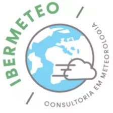

    <h2 style="font-size: 18.5px;">Hey there! 👋</h2>

<section>
    Welcome to my Github profile! I'm Carlos - a Software Engineer with a taste for the Front-End and automating repetitive tasks.
</section>

 

<strong>About me</strong> 

- I'm a Software Engineer based in Portugal and I currently work full time in the health sector for <a href="https://knokcare.com/">Knok</a>.  
- I'm a fitness enthusiast, on a mission to transform mind and body every day!  
- I'm passionate about learning and exploring new technologies.  
- I freelance for amazing companies and projects.  

 

<strong>What people say about me</strong>

<table>
    <tr>
        <td></td>
        <td>
            We are pleased to have Carlos Pereira as our freelance web developer. Over the past few years Carlos has been an integral part of the developments we have made in this area, and the partnership we have established has proved to be a clear winning bet!  
We highlight his work capacity, proactivity in finding solutions for all our needs, without forgetting the clarity of communication and easy handling. His evolved knowledge in the latest technologies, also allow us, Ibermeteo, to provide a better service for our customers.
              
            <b>Tiago Rodrigues - Ibermeteo</b> (29/01/2021)
        </td>
    </tr>
    <tr>
        <td align="center"></td>
        <td>
            Carlos, besides being a great person, is a great professional. Always attentive to detail and with the perspective of an excellent execution of the code he writes. Carlos is highly focused on his goals, always respecting the plannings. Today, as certainly in the future, it's always a pleasure to work with Carlos.
              
            <b>Ricardo Pires - Work Coleague</b> (29/01/2021)
        </td>
    </tr>
    <tr>
        <td></td>
        <td>
            Carlos has been an excellent co-worker, always ready to help and collaborate. Allied to this, he has a knowledge of new technologies far above the average, which makes his help and collaboration indispensable.
With clear, concise and functional explanations, he never lets us down. It is easy to work like this!
              
            <b>Tiago Freitas - Work Coleague</b> (08/03/2021)
        </td>
    </tr>
     <tr>
        <td></td>
        <td>
            Carlos is truly one of the best colleagues I've had the privilege of working alongside. From the early days of our collaboration, he's consistently delivered exceptional work and demonstrated an insatiable appetite for learning. Starting his journey at a young age, his growth has been remarkable.
  His adaptability shines as he seamlessly transitions from Vue.js frontend projects to various frameworks and multiple backends.   What's truly impressive is his unwavering dedication to staying at the forefront of new technologies. His contributions to open-source projects and his personal ventures like building servers exemplify this commitment.
  What sets Carlos apart is not just his technical prowess, but his genuine eagerness to share his knowledge and collaborate with teammates. He's an approachable individual who thrives on finding solutions. His likable nature and problem-solving skills make him an invaluable asset.
  Beyond being a talented developer, Carlos is a driving force within his team. His dedication to improvement is contagious, and the impact of his contributions on the projects is undeniable. It's inspiring to see his enthusiasm for progress, and I'm excited to see what he will bring next to the world.
              
            <b>Ricardo Ribeiro - Engineering Lead</b> (21/08/2023)
        </td>
    </tr>
</table>

<h5 align="center">
    
    
</h5>

<h5 align="center">
    <a href="https://www.linkedin.com/in/carlosdevpereira/" target="_blank" title="LinkedIn Profile">
        
        LinkedIn
    </a>
    <a href="https://stackoverflow.com/users/6718719/carlosdevpereira" target="_blank" title="Stack Overflow Profile">
         
        Stack Overflow
    </a>
    <a href="https://www.instagram.com/carlosdevpereira/" target="_blank" title="Instagram Profile">
        
        Instagram
    </a>
    <h6 align="center">
        --- @carlosdevpereira ---
        

            
                Icons from <a href="https://icons8.com/">Icons8</a> ❤️
            
        

    </h6>
</h5>
